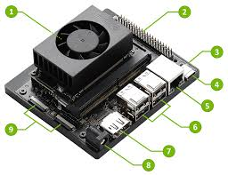

<!-- 未來科技感主題設計 -->

  
  <h1 style="font-size: 3em; letter-spacing: 2px; color: #00ffe7; text-shadow: 0 0 12px #00ffe7, 0 0 24px #0ff;">Jetson Orin Nano</h1>
  
  
  
  

    <a href="./src/upda-python/README.md" style="color: #fff; background: #00ffe7; padding: 12px 32px; border-radius: 8px; margin: 8px; text-decoration: none; font-weight: bold; box-shadow: 0 0 8px #00ffe7;">更新 Python 版本</a>
    <a href="./src/download-code-rely/README.md" style="color: #fff; background: #00ffe7; padding: 12px 32px; border-radius: 8px; margin: 8px; text-decoration: none; font-weight: bold; box-shadow: 0 0 8px #00ffe7;">安裝未來工程程序的依賴</a>
    <a href="./src/install-fcitx/README.md" style="color: #fff; background: #00ffe7; padding: 12px 32px; border-radius: 8px; margin: 8px; text-decoration: none; font-weight: bold; box-shadow: 0 0 8px #00ffe7;">安裝中文輸入法(新酷音)</a>
  

  
  

    🚀 讓你的 Jetson Orin Nano 進入未來世界！
  

